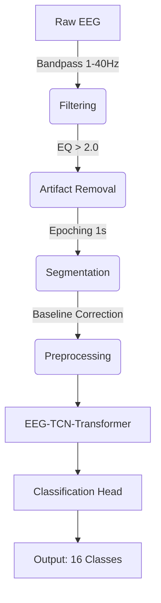

# EEG Arabic Imagined Speech Decoding (Per-Participant Models)

## Project Overview
This project implements a **Subject-Dependent (Per-Participant)** deep learning approach for classifying 16 Arabic words from EEG brain signals. Utilizing a hybrid **EEG-TCN-Transformer** architecture, the system decodes imagined speech from non-invasive EEG recordings (Emotiv EPOC X).

Unlike general models that struggle with inter-subject variability, this project trains individual models for each participant, maximizing decoding accuracy for personalized BCI applications.

### Key Features
- **Hybrid Architecture**: EEGNet + Temporal Convolutional Network (TCN) + Transformer.
- **Subject-Dependent Training**: Dedicated models trained on each participant's data.
- **Robust Preprocessing**: 
  - Bandpass filtering (1-40 Hz)
  - Artifact removal (EQ cleaning)
  - Epoching with overlap
  - Baseline correction
- **Comprehensive Analysis**: Per-participant performance tracking and visualization.

## Dataset
**ArEEG_Words - Arabic Imagined Speech EEG Dataset**

| Property | Value |
|----------|-------|
| **Classes** | 16 Arabic words |
| **Participants** | ~22 subjects |
| **EEG Channels** | 14 (Emotiv EPOC X) |
| **Sampling Rate** | 128 Hz |
| **Resolution** | 14 bits |

### Word Classes
| Arabic | English | Arabic | English |
|:---:|:---:|:---:|:---:|
| اختر | Select | حمام | Bathroom |
| اسفل | Down | دواء | Medicine |
| اعلى | Up | عطش | Thirst |
| انذار | Alarm | لا | No |
| ايقاف تشغيل | Stop | مسافة | Space |
| تشغيل | Start | نعم | Yes |
| جوع | Hunger | يسار | Left |
| حذف | Delete | يمين | Right |

### EEG Channels
`AF3, F7, F3, FC5, T7, P7, O1, O2, P8, T8, FC6, F4, F8, AF4`

## Architecture
**EEG-TCN-Transformer**

This hybrid model combines the strengths of three architectures to capture spatial, temporal, and long-range dependencies in EEG signals:

1.  **EEGNet Integration**: Spatial convolution to extract features across EEG channels.
2.  **Temporal Convolutional Network (TCN)**: Dilated convolutions to capture temporal patterns with a large receptive field.
3.  **Transformer Encoder**: Self-attention mechanism to model long-range dependencies and importance of specific time segments.

### Pipeline


## Installation

### Prerequisites
- Python 3.8+
- Jupyter Notebook
- PyTorch (with CUDA recommended)

### Setup
1.  **Clone the repository**
    ```bash
    git clone https://github.com/YourUsername/NeuraTech.git
    cd NeuraTech
    ```

2.  **Install dependencies**
    ```bash
    pip install numpy pandas matplotlib seaborn scipy scikit-learn torch torchvision torchaudio notebook
    ```
    *(Note: Adjust PyTorch installation command based on your CUDA version from [pytorch.org](https://pytorch.org))*

## Project Structure

```
c:\AgorAI Hackathon\
├── كلمات/                        # Dataset Folder (Arabic Words)
│   ├── اختر/                     # 'Select'
│   ├── اسفل/                     # 'Down'
│   └── ...                       # Other word folders
├── participant_models/           # Saved .pth models for each participant
├── best_model_foldX.pth          # Checkpoints from cross-validation
├── model_per_participant.ipynb   # Main notebook for training & evaluation
├── recording_boundaries.json     # Metadata
└── README.md                     # This file
```

## Quick Start
The entire pipeline is contained within the Jupyter Notebook `model_per_participant.ipynb`.

1.  **Open the Notebook**:
    ```bash
    jupyter notebook model_per_participant.ipynb
    ```

2.  **Configure Data Path**:
    In the first code cell, find and update the `BASE_FOLDER` variable if your dataset is in a different location:
    ```python
    BASE_FOLDER = r"C:\AgorAI Hackathon\كلمات"
    ```

3.  **Run All Cells**:
    Execute the notebook cells to:
    - Load and clean the data.
    - Preprocess signals (Filtering, Epoching).
    - Train individual models for each participant.
    - Visualize accuracy distributions and save models to `participant_models/`.

## Results
The notebook generates detailed per-participant analysis:

- **Accuracy Distribution**: Histogram and boxplots of participant performance.
- **Best/Worst Performers**: Identification of subjects with high BCI illiteracy vs. high controllability.
- **Training Curves**: Loss and accuracy plots for the best-performing models.

*Example Output:*
- **Mean Accuracy**: (Varies by run, e.g., ~70-90% for top subjects)
- **Random Baseline**: 6.25% (1/16 classes)

## Contributing
Contributions are welcome!
1. Fork the repository
2. Create your feature branch (`git checkout -b feature/AmazingFeature`)
3. Commit your changes (`git commit -m 'Add some AmazingFeature'`)
4. Push to the branch (`git push origin feature/AmazingFeature`)
5. Open a Pull Request

## Acknowledgments
- **ArEEG Dataset**: Arabic Imagined Speech EEG
- **Emotiv EPOC X**: Hardware used for data collection
